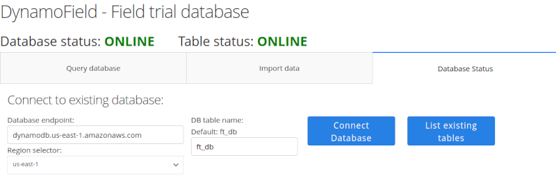

# DynamoField: Flexible field trial database
- [DynamoField: Flexible field trial database](#dynamofield-flexible-field-trial-database)
  - [Requirements and setup](#requirements-and-setup)
    - [Configure credentials for AWS DynamoDB](#configure-credentials-for-aws-dynamodb)
    - [DynamoDB Local version](#dynamodb-local-version)
  - [Getting started with DynamoField](#getting-started-with-dynamofield)
  - [Usage](#usage)
      - [Database status panel](#database-status-panel)
      - [Import data panel](#import-data-panel)
      - [Query data panel](#query-data-panel)
  - [Example](#example)

------

DynamoField is a highly customizable database framework that collects, organizes, and analyzes field trial data.

DynamoField provides a frontend web interface, and AWS DynamoDB powers the backend NoSQL database.


## Requirements and setup

Please make sure the following programs are installed.
- Download the latest version of **DynamoField** from the `release` page form GitHub
   - Alternatively, `git clone` the latest version from the `main` branch.

- [Python 3.9 or higher](https://www.python.org/)
  - Option 1: Use the setup script. This will try to install Python dependencies and the local version of DynamoDB.
    - MacOS/Linux: `0_init.sh`
    - Windows: `0_init.bat`
  - Option 2: Manually install dependencies
    - Install required Python libraries.
      If `pip/pip3` is not available, please install it from [pip](https://pip.pypa.io/en/stable/).
      ```
      # MacOS/Linux - Terminal
      pip install -r requirements.txt

      # Windows - Command Prompt
      py -m pip install -r requirements.txt
      ```


### Configure credentials for AWS DynamoDB
  - Create a free [AWS account](https://aws.amazon.com/)
  - Setup security credentials with [AWS access key](https://docs.aws.amazon.com/IAM/latest/UserGuide/id_credentials_access-keys.html#Using_CreateAccessKey)
  - Install [AWS CLI](https://docs.aws.amazon.com/cli/latest/userguide/getting-started-install.html)
  - [Setting up new configuration and credentials](https://docs.aws.amazon.com/cli/latest/userguide/getting-started-quickstart.html)
  - [Optional]: Use DynamoDB with AWS console. [DynamoDB Documentation](https://docs.aws.amazon.com/amazondynamodb/latest/developerguide/SettingUp.DynamoWebService.html)

### DynamoDB Local version
- Install [Java (JRE 8 or higher)](https://www.java.com)
- Option 1: Use the setup script. This will try to install Python dependencies and the local version of DynamoDB.
    - MacOS/Linux: `0_init.sh`
    - Windows: `0_init.bat`
- Option 2: Download and uncompress [DynamoDB Local](https://d1ni2b6xgvw0s0.cloudfront.net/dynamodb_local_latest.zip)


## Getting started with DynamoField

- Option 1: AWS DynamoDB
  - Please make sure AWS CLI is setup and configured with the proper credentials.

- Option 2. Starts DynamoDB Locally
   - Option 1: Execute startup script.
     - MacOS/Linux: `1_start_dynamodb.sh`
     - Windows: `1_start_dynamodb.bat`
   - Option 2: Manually start DynamoDB Local
     ```
     java -Djava.library.path=./DynamoDBLocal_lib -jar DynamoDBLocal.jar [options]
     ```
     For more information on available options, run with the -help option:
     ```
     java -Djava.library.path=./DynamoDBLocal_lib -jar DynamoDBLocal.jar -help
     ```


- Start **DynamoField** and open [http://127.0.0.1:8050/](http://127.0.0.1:8050/) in the browser.
  - **MacOS/Linux**
    - Execute `2_run_DynamoField.sh`
    - OR manually runs python
      ```
      python3 src/dynamofield.py
      ```
  - **Windows**
    - Execute `2_run_DynamoField.bat`
    - OR manually runs Python
      ```
      py src/dynamofield.py
      ```

## Usage
There are a few core concepts and terminologies for **DynamoField**.

- **Database endpoint:** Each database server has a unique database endpoint address.
  - The default endpoint for the local server is `http://localhost:8000/`.
  - For AWS DynamoDB, select the aws regional endpoint.

- **Data_table:** Each database can support multiple data_tables. Data_tables are independent of each other, and generally, they do not share data across multiple data_tables.
  - The typical usage for the `data_table` is storing unrelated trials at separate `data_table`, i.e., yield trial for crops and Disease trial for fruit trees.

- **field_trial_id:** Each trial has a unique ID. This column is required for all data.

- **data_type:** Within each trial, information is categorized into multiple different **data_type**. There are no strict rules on how data is divided into categories; however, it is recommended that grouping data collected similar information together. For example;
  - Trt: Treatment information such as treatment id, treatment code, treatment name, etc.
  - Contact: Contact information include contact person, phone number, email address, company name, etc.
  - Plot: Yield for each plot, plot location, treatment id, etc.
  - Management: farm management throughout the trial season, including irrigation system, date and amount of fertilizer or pesticides applied, weed management, etc.

**Recommendation:** Keep the naming scheme consistent.


#### Database status panel
- Connect to the database endpoint. The default endpoint for the local server is `http://localhost:8000/`
- Enter data_table name.
  - If this is the first time using the database, please create a new data_table (i.e., `ft_db`) using `Create New Table`
  - Use "List Existing Tables" to get all tables in the current database endpoint.
- Click **Connect Database**

    - AWS DynamoDB:

    

    - Local DynamoDB:

    


#### Import data panel
Import data in CSV format into the database
- Upload a CSV file
- Enter a **data_type**
- Choose between "Insert new data" or "Replace existing".
- Click **Import Data**

#### Query data panel
- Query data from the database
- Merge data from multiple **data_type**
- Plotting data
- Perform basic statistical analysis
- Export data


## Example

### Example basic demo
1. **Database Status panel:** Connect to the database and DB table.
   1. Database endpoint: `http://localhost:8000`
   2. Click **Connect Database**. The database status should change to **ONLINE**. If not, please make sure the endpoint is correct, and the DynamoDB local server is running.
   3. Enter `ft_db` in DB table name, and click "Connect Database" again. Both Database status and Table status should be **ONLINE**.
      - First time user. Enter `ft_db` at "Create a new table", and click **Create New Table**.

2. **Import data panel:**  Upload example dataset from the `example_basic` folder

    | filename       | data_type  |
    | -------------- | ---------- |
    | eg_contact.csv | contact    |
    | eg_management  | management |
    | eg_meta.csv    | meta       |
    | eg_plot.csv    | plot       |
    | eg_trt.csv     | trt        |

    To import these tables into the database:
    1. Select one `CSV` file from the example folder.
    2. [Optional]: Use **Preview File** to check the contents
    3. Import info_type: Enter the corresponding value from the table.
    4. Select `Insert new data`, and this will append import data to the current database. On the other hand, `Replace existing` will overwrite the existing data for a given info_type
    5. Click **Import Data**

3. **Query database panel:** Fetch data
   1. Select trial ID: `crop_yr1_t01` and `crop_yr1_t02` (crop name, year 1, trial 1)
   2. Select **info_type**: `plot`, `trt`, and `seed`
   3. Click **Fetch Data**. This will query the database and fetch records that satisfy these filtering criteria.

4. **Merging multiple info_type**
   1. Select two **info_type**
   2. Select the columns you would like to merge.
   3. Click "Merge Tables"
   4. The merged table is displayed at the bottom.

5. **Plotting data:**
   1. Select `trt` for "x-axis", and `yield` "y-axis"
   2. Optional: Select "Colour by"
   3. Select the "plot type"
   4. Click "Plot Data"
   5.  Plotting panel with build-in figure control

6.  **Statistical analysis:**
   1.  Select `trt` for "Factor", and `yield` for "Response"
   2. Optional: Select "Slice by"
   3. Click "Analysis" or "Summary"


### Example OFT dataset
This example contains 17 field trials from Online Farm Trials (OFT) https://www.farmtrials.com.au/

1. **Database Status panel:** Connect to the database and DB table.
   1. Database endpoint: `http://localhost:8000`
   2. Click **Connect Database**. The database status should change to **ONLINE**. If not, please make sure the endpoint is correct, and the DynamoDB local server is running.
   3. Enter `ft_oft` in DB table name, and click "Connect Database" again. Both Database status and Table status should be **ONLINE**.
      - First time user. Enter `ft_oft` at "Create a new table", and click **Create New Table**.


2. **Import data panel:**  Upload example dataset from the `example_OFT` folder

    The filenames use the following naming conventions
    `oft_trial_TRIAL_ID_key_DATA_TYPE.csv`

    | filename                                 | trial_id       | data_type | Description                          |
    | ---------------------------------------- | -------------- | --------- | ------------------------------------ |
    | oft_key_copyright.csv                    | -              | copyright | Copyright information for all trials |
    | oft_trial_9176109_key_info.csv           | 9176109        | info      | Information for this trial           |
    | oft_trial_9176109_key_result1.csv        | 9176109        | result    | Result 1 from this trial             |
    | oft_trial_9176109_key_result2.csv        | 9176109        | result    | Result 2 from this trial             |
    | oft_trial_SCF_LimeTrials_key_info.csv    | SCF_LimeTrials | info      | Information for this trial           |
    | oft_trial_SCF_LimeTrials_key_result1.csv | SCF_LimeTrials | result    | Result 1 from this trial             |
    | oft_trial_SCF_LimeTrials_key_result2.csv | SCF_LimeTrials | result    | Result 2 from this trial             |

    To import these tables into the database:
    1. Select one `CSV` file from the example folder.
    2. [Optional]: Use **Preview File** to check the contents
    3. Import info_type: Enter the corresponding value from the table.
    4. Select `Insert new data`, and this will append import data to the current database. On the other hand, `Replace existing` will overwrite the existing data for a given info_type
    5. Click **Import Data**


## Others
- DynamoField can be used as a standalone
  ```
  pip install DynamoField
  ```
- Testing with `pytest`. This required local version of DynamoDB
